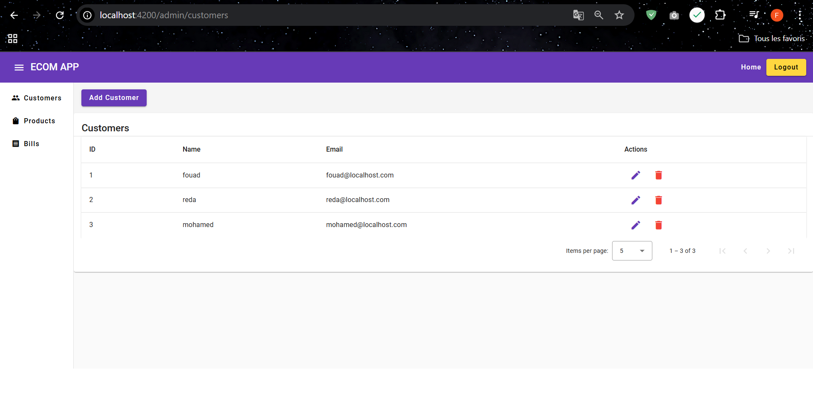

# ECOMMERCE APP ANGULAR

* check backend with microservices spring boot : https://github.com/fouad-saidi-dev/ecom-spring-cloud-microservice

## CUSTOMERS MANAGEMENT SYSTEM

### GET CUSTOMERS :

### GET PRODUCTS :

### GET BILLS :

### GET PRODUCT ITEM OF BILL :

