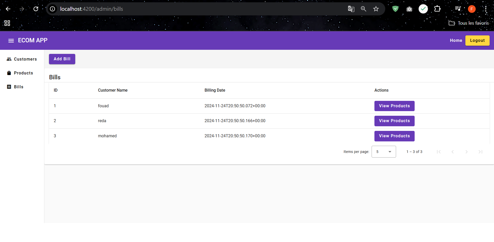

# ECOMMERCE APP ANGULAR

* check backend with microservices spring boot : https://github.com/fouad-saidi-dev/ecom-spring-cloud-microservice

## CUSTOMERS MANAGEMENT SYSTEM

### GET CUSTOMERS :

### ADD CUSTOMER :

### AFTER ADD CUSTOMER :

### EDIT CUSTOMER :

### AFTER EDIT CUSTOMER :

### DELETE CUSTOMER :

### AFTER DELETE CUSTOMER :

### GET PRODUCTS :

### ADD PRODUCT :

### AFTER ADD PRODUCT :

### EDIT PRODUCT :

### AFTER EDIT PRODUCT :

### DELETE PRODUCT :

### AFTER DELETE PRODUCT :

### GET BILLS :

### GET PRODUCT ITEM OF BILL :

